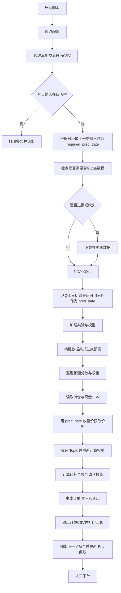

# Manual Trading Script Design

## Goal
日频手工交易流程：当天运行脚本，使用上一交易日数据生成信号，输出订单 CSV 供人工下单。

## Inputs
- 交易日历：`examples/custom/trade_calendar_base.csv`（周一到周五，2026 年）
- 持仓/现金 CSV：`code,position`（示例：`CASH,500000`）
- 训练记录：`experiment_id` + `recorder_id`
- Qlib 数据路径：`provider_uri`

## Outputs
- 订单 CSV：`order_id,stock,action,shares,price,amount,score,weight`
- 控制台摘要：trade_date、pred_date、总资产、可用资金、买卖金额等
- PnL 曲线：`examples/custom/pnl_history.csv`（date,total_asset,daily_pnl,daily_return,cum_return）

## Flow

